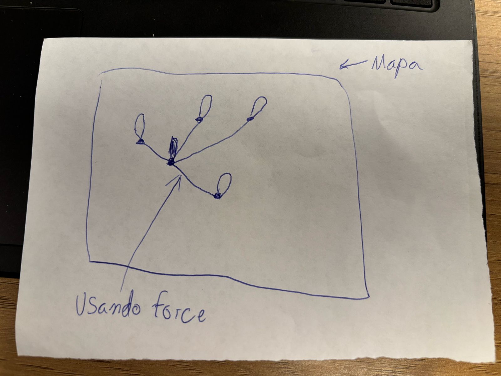
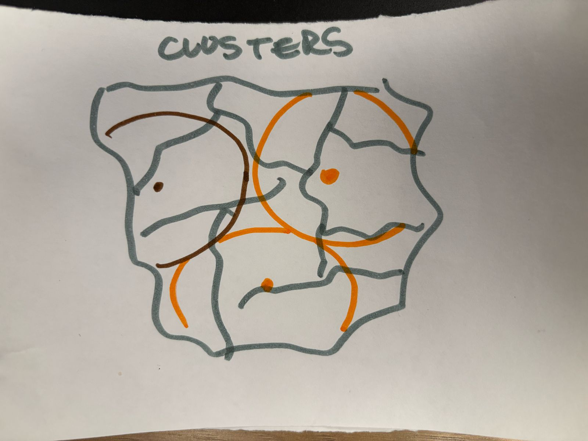

# Documentação da Atividade Ponderada

Nosso grupo se dividiu em dois trios para o desenvolvimento da atividade, inicialmente realizamos uma rodada de apresentação de ideias para definirmos quais representações gráficas de grafos iriamos utilizar para realizar a demonstração para o parceiro nesta review.

## Execução dos mapas

Os códigos foram desenvolvidos utilizando a lib D3.js em html, necessitando rodar os arquivos em um serviço, pois o d3.js, necessita da utilização do ```fecth```, acabando por bloquear via politica de CORS, requsições diretas quando você abre o arquivo diretamente na máquina sem um serviço, dessa forma não conseguindo carregar o arquivo geoJson, para rodar via serviço segue o passo a passo abaixo:

1. Clonar o repositório
2. Abrir o repositório clonado na IDE Visual Studio Code
3. Navegar até a seção de extenções e intalar a extensão: "Live Server"
4. Após instalar a extensão você deve abrir o arquivo e Abrir utilizando o Live Server

## Ideia 1 - Sistema de Visualização em Grafos de HomeBases para Chamados

Nesta ideia cada home base vai ser interligada a um chamado, não conseguimos finalizar o código desta ideia, mas o iniciamos e conseguimos plotar o mapa de São Paulo, até a review de amanhã este código estará finalizado.

### Grupo:
- Guilherme Carvalho  
- Mateus Beppler  
- Pedro Siqueira  

### O que é e como ajuda no projeto:
A visualização em grafos conecta HomeBases às demandas no mapa de São Paulo. Conseguimos implementar a plotagem do mapa de São Paulo como base utilizando **d3.js** e iniciamos o código para conectar as bases aos chamados.  

Este sistema vai ajudar nosso projeto de várias formas:  
1. **Visualização Geográfica**: Permitirá visualizar claramente a distribuição geográfica dos chamados e das HomeBases.  
2. **Facilidade na Atribuição de Chamados**: Facilitará a atribuição de chamados aos gasistas com bases próximas.  

A representação visual com linhas de diferentes cores conectando HomeBases e demandas torna mais intuitivo entender quais bases atendem quais chamados, permitindo ajustes rápidos na distribuição de serviços conforme necessário.




## Ideia 2

Nesta ideia representam novas home bases e o raio de atuação dos gasistas, não conseguimos finalizar o código dessa ideia duante a instrução mas até o review de amanhã este código estará finalizado.


