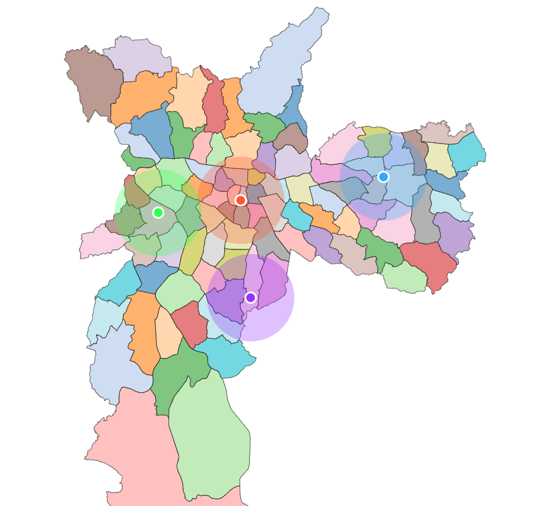

# Documentação da Atividade Ponderada

Nosso grupo se dividiu em dois trios para o desenvolvimento da atividade, inicialmente realizamos uma rodada de apresentação de ideias para definirmos quais representações gráficas de grafos iriamos utilizar para realizar a demonstração para o parceiro nesta review.

## Execução dos mapas

Os códigos foram desenvolvidos utilizando a lib D3.js em html, necessitando rodar os arquivos em um serviço, pois o d3.js, necessita da utilização do ```fecth```, acabando por bloquear via politica de CORS, requsições diretas quando você abre o arquivo diretamente na máquina sem um serviço, dessa forma não conseguindo carregar o arquivo geoJson, para rodar via serviço segue o passo a passo abaixo:

1. Clonar o repositório
2. Abrir o repositório clonado na IDE Visual Studio Code
3. Navegar até a seção de extensões e intalar a extensão: "Live Server"
4. Após instalar a extensão você deve abrir o arquivo e Abrir utilizando o Live Server

## Ideia 1 - Sistema de Visualização em Grafos de HomeBases para Chamados

Nesta ideia cada home base vai ser interligada a um chamado, não conseguimos finalizar o código desta ideia, mas o iniciamos e conseguimos plotar o mapa de São Paulo, até a review de amanhã este código estará finalizado.

### Trio:
- Guilherme Carvalho  
- Gustavo Colombini
- Pedro Siqueira  

### O que é e como ajuda no projeto:
A visualização em grafos conecta HomeBases às demandas no mapa de São Paulo. Conseguimos implementar a plotagem do mapa de São Paulo como base utilizando **d3.js** e iniciamos o código para conectar as bases aos chamados.  

Este sistema vai ajudar nosso projeto de várias formas:  
1. **Visualização Geográfica**: Permitirá visualizar claramente a distribuição geográfica dos chamados e das HomeBases.  
2. **Facilidade na Atribuição de Chamados**: Facilitará a atribuição de chamados aos gasistas com bases próximas.  

A representação visual com linhas de diferentes cores conectando HomeBases e demandas torna mais intuitivo entender quais bases atendem quais chamados, permitindo ajustes rápidos na distribuição de serviços conforme necessário.


## Ideia 2 - Visualização da cobertura das HomeBases

Nesta ideia, usamos D3.js para mostrar no mapa onde estão as home bases e até onde os gasistas conseguem atender. O código carrega um arquivo GeoJSON com os distritos de São Paulo e adiciona pontos que representam as bases, destacando seu alcance.

### Trio:

- Eduardo Fidelis
- Larissa Martins
- Mateus Beppler


### O que é e como ajuda no projeto:

Essa visualização é importante para entender se os gasistas estão bem distribuídos pela cidade. Com os distritos e os círculos mostrando o raio de cada home base, conseguimos:

1. **Identificar áreas sem cobertura:** Se houver regiões sem círculos, significa que esses locais podem estar sem atendimento.

2. **Evitar sobrecarga em algumas áreas:** Se os círculos estiverem muito em cima uns dos outros, pode ser que alguns lugares tenham mais equipes do que precisam, enquanto outros ficam sem suporte.

3. **Melhorar o planejamento das rotas:** Com a visão geral das home bases e seus alcances, fica mais fácil organizar os deslocamentos dos gasistas, economizando tempo e recursos.

4. **Ajudar na tomada de decisões:** Com tudo bem visualizado, podemos decidir melhor onde colocar novas bases ou como distribuir melhor as equipes.

### Resultado



A imagem acima mostra o resultado gerado pelo código. Os distritos de São Paulo são representados no mapa, e cada home base é destacada com um círculo que indica seu raio de atuação. Essa abordagem ajuda a visualizar melhor a cobertura das homebases na cidade. 

